# Mysterious Things - Project Portfolio 1 - HTML & CSS 

Mysterious Things is a website designed to offer deep insights into the spiritual and mystical realms.
It serves as a guide for anyone interested in exploring Tarot cards, Runes, and Oracle readings.
The platform also features a dedicated question page to address users' curiosities about these esoteric practices.

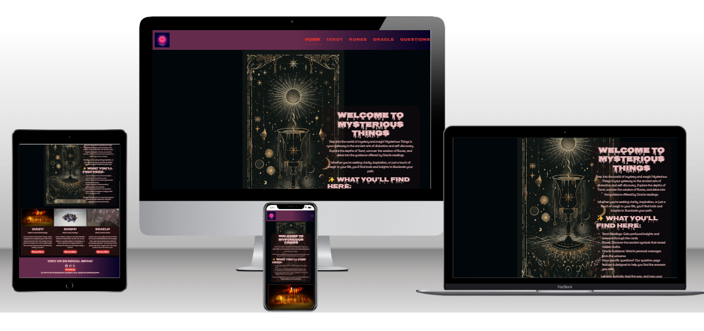

Overview

# CONTENTS

* [User Experience](#user-experience-ux)
    * [User Stories](#user-stories)
* [Design](#design)
    * [Color Scheme](#color-scheme)
    * [Typography](#typography)
    * [Images](#images)
    * [Wireframe](#wireframe) 
    * [Features](#features)
        * [The Home Page](#the-home-page)
        * [The Tarot Page](#the-tarot-page)
        * [The Rune Page](#the-rune-page)
        * [The Oracle Page](#the-oracle-page)
        * [The Questions Page](#the-question-page)
        * [The Success Page](#the-success-page)
        * [The Error Page](#the-error-page)
    * [Accessibility](#accessibity)
* [Technologies Used](#technologies-used)
    * [Languages Used](#languages-used)
    * [Frameworks, Libraries & Programs Used](#frameworks-libraries--programs-used)
* [Deployment & Local Development](#deployment--local-development) 
    * [Deployment](#deployment)
    * [Local Development](#local-development)
* [Testing](#testing)
    * [Solved Bugs](#solved-bugs)
    * [Known Bugs](#known-bugs)
* [Credits](#credits)
    * [Code Used](#code-used) 
    * [Content](#content)
    * [Media](#media)
    * [Acknowledgments](#acknowledgments)

---

## User Experience (UX)

### Target Audience
* Those who are looking for a page that can give them the information they want

#### User Stories

* As a visitor, I want to see an attractive homepage, so I can easily navigate to the Tarot, Runes, Oracle, and Question sections.
* As a visitor, I want the website to have a mystical theme, so I feel immersed in the experience.
* As a visitor, I want to fill out a question form, so I can submit my thoughts.

#### Site Aims
* I want to be able to take a closer look on each card or rune.
#### Frequent Visitor Goals
* Able to find out new things about the different sides.
* I can send a question to find out more if i want to.

---
## Design

### Color Scheme 
I have chose the color based on the mystical theme that the page is build on.

In my css file i have mostly used variables to declare color, and used these throughout the css file.
its useful to ise the same color code if you wish to alter the color on the webpage.
* I have used #d13333 & #ecbdbd as the primary and secondary color used for the sites text.
* I have used gradient-bg: linear-gradient
    90deg,
    rgba(101, 43, 76, 1) 51%,
    rgba(2, 0, 36, 1) 100%,
    rgba(0, 212, 255, 1) 100%
as the background-color.
* I have used background-color: #01060a as background-color.
* I have used #d13333 as the border color.

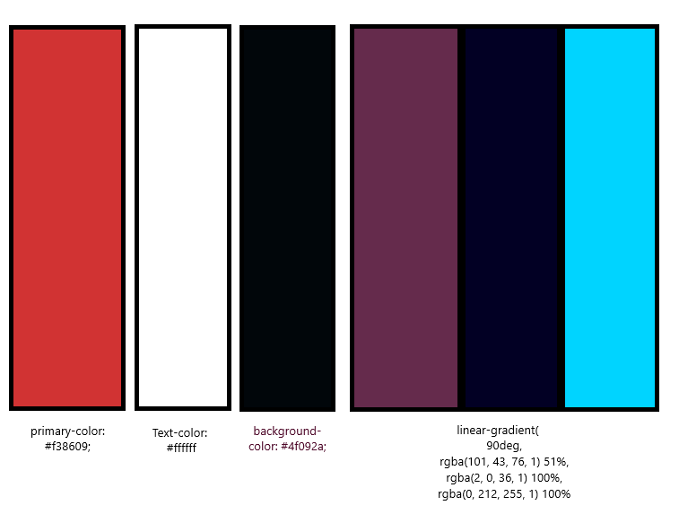
### Typography
Google Fonts was used to import the chosen fonts for the site.
* For almost all text i used the google font [Delius](https://fonts.google.com/specimen/Delius?preview.text=Mysterious%20Things)

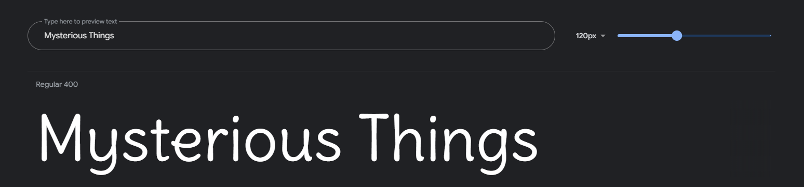

* For the big texts i used [Nosifer](https://fonts.google.com/specimen/Nosifer?preview.text=Mysterious%20Things)

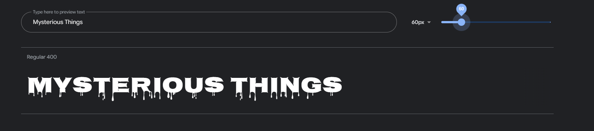
### Images
* As the website is called Mysterious Things, i wanted to use a page background of a tarot card that give the user a mysterious feeling.
### Wireframe 
Wireframes were created for mobile, tablet and laptops using balsamiq.
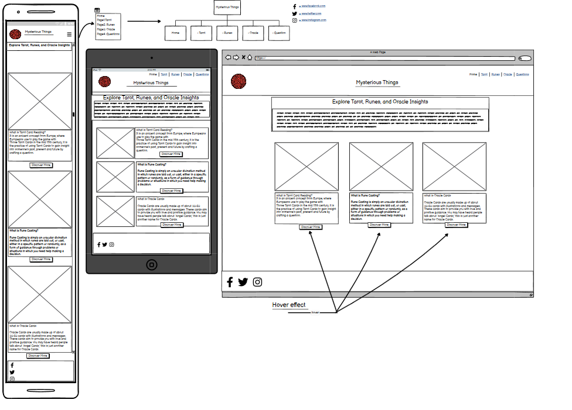
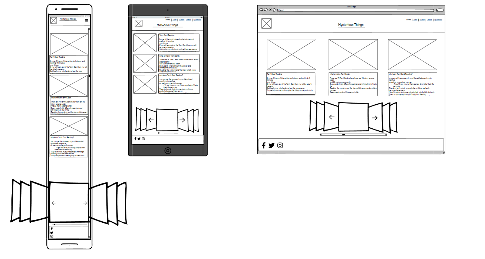
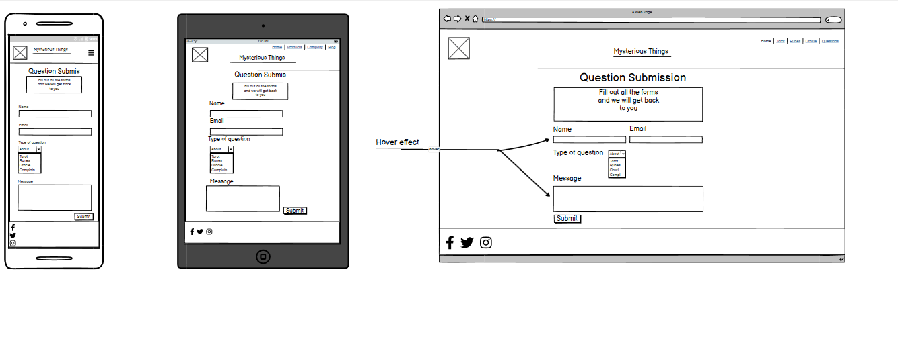
### Features 
The website build with a home page, a tarot page, a rune page, a oracle page and a question page.
All pages on the website are responsive and have:
* A favicon in the browser tab.
 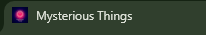
 * I have the logo in the left upper corner on all the pages. This logo also acts as a link back to home page.
 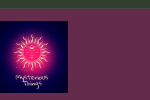

#### The Home Page
The home page of Mysterious Things the sites name as a logo and then a container which holds some welcome text, including alerting the users that they can navigate back to the home page at any time by clicking on the logo

After the container you will see tree bootstraps card's including the tree side page and a button on each 
that will redirect you to that specific page when pushed on. And the footer with a text that tells you that you can visit them on the social medias bellow, and a button that will take you to the top if you like.
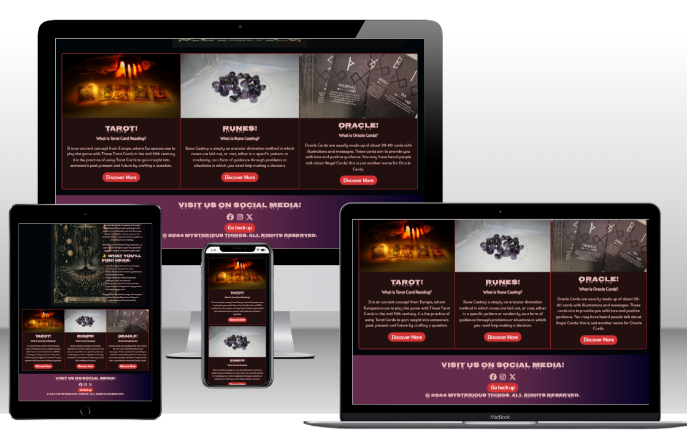

#### Tarot Page
The tarot page displays the logo and a header with a mysterious text, and tree card's with more information.
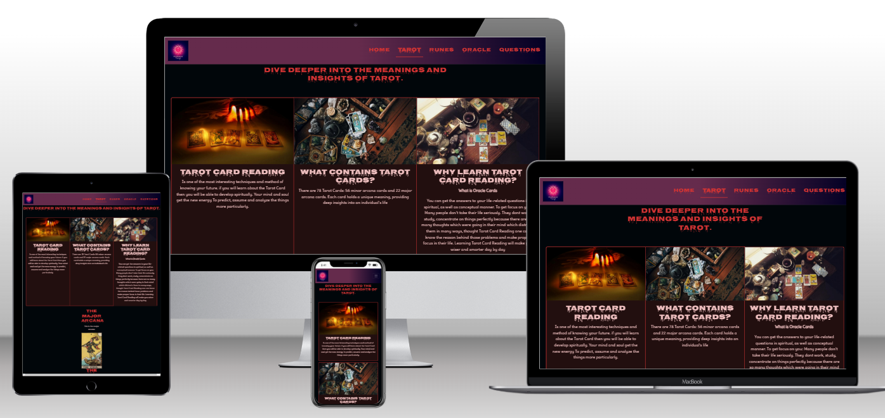
 And after that it comes a carousel with cards taken from the tarot deck the major arcana.
 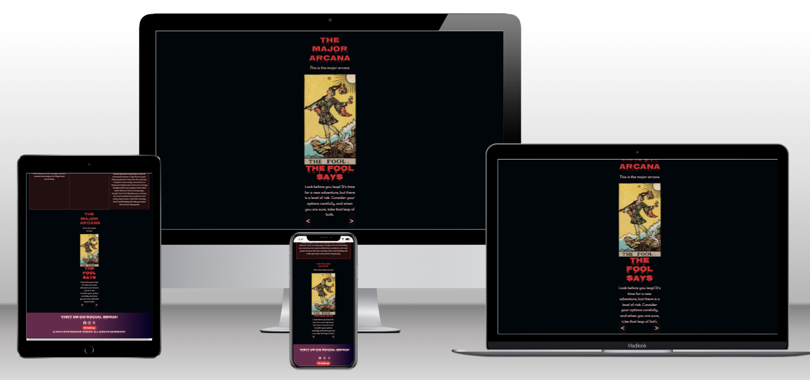

 #### Rune Page 
 This page is almost the same different images and text's
